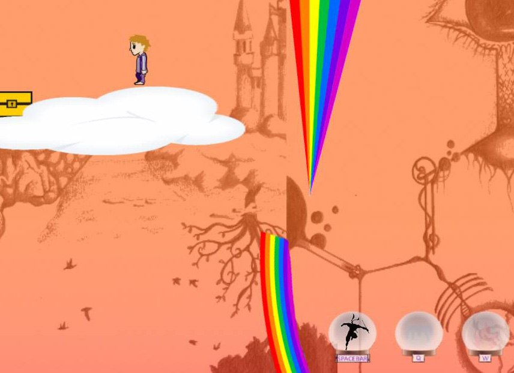

# Dreamatorium
[Dreamatorium](http://www.cs.otago.ac.nz/cosc360/game-projects-dreamatorium.php) is 2D puzzle/adventure platformer. Journey through a total of three dreamscapes in order to face off against your worst enemy in an epic battle.

### About

#### Levels
1. [Ice Iceworld](Assets/Snapshots/IceWorld.jpg)
2. [Dreamscape](Assets/Snapshots/Dreamscape.jpg)
3. [Lava World](Assets/Snapshots/LavaWorld.jpg)
4. Final Boss

#### CONTROLS
* Use the LEFT and RIGHT arrow keys to traverse your dreams.
* Use SPACEBAR to jump.
* Double tap space to jump twice (after you collect the ability).
* Use Q to drop a block of ice (after you collect the ability).
* Use W to shoot a fireball (after you collect the ability).
* When in main and pause menu use ENTER to select options.

### Development
#### Tools and Dependencies
1. [Unity Game Engine](https://store.unity.com/download-nuo)
#### Run
1. Clone repo: `https://github.com/lenzoburger/Dreamatorium.git`
2. Launch [Unity Game Engine](https://store.unity.com/download-nuo)
3. Open Project in Unity & run
